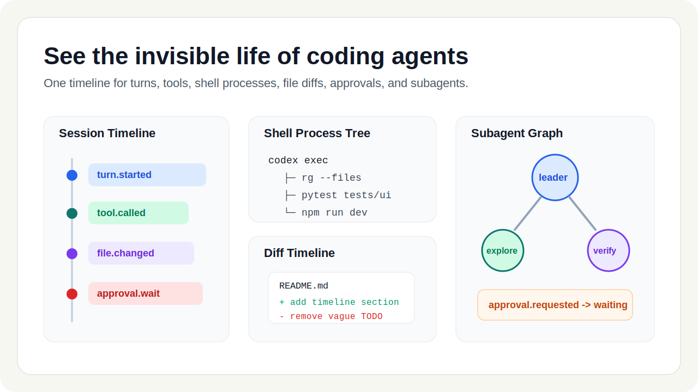
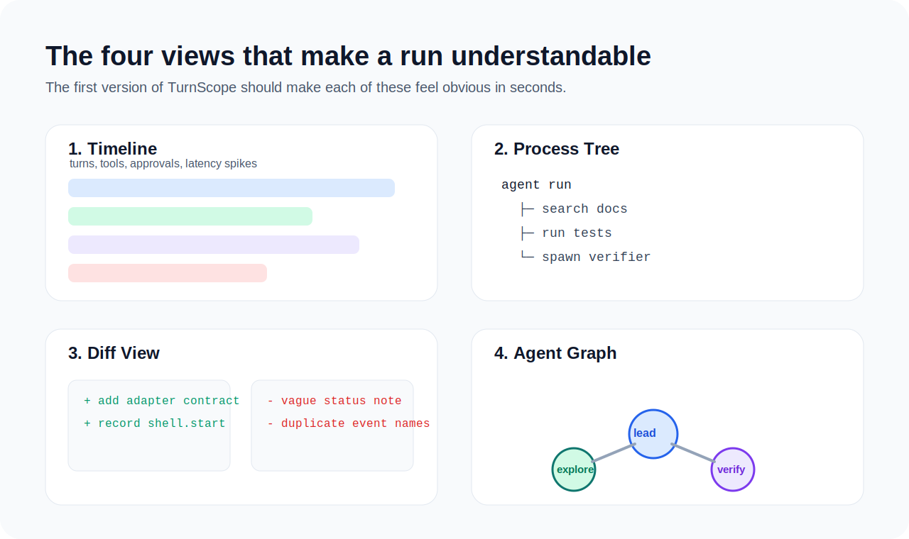
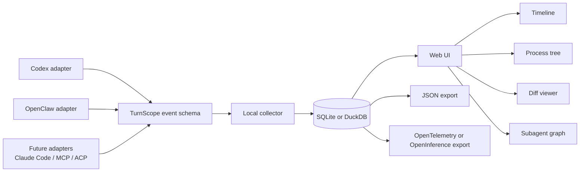

# TurnScope


<p align="center">
  
</p>

Local-first observability and replay for coding agents.

TurnScope is an open-source visibility layer for tools like Codex, OpenClaw, and future MCP/ACP-style runtimes. It is built to answer a simple question:

**What exactly happened during this agent run?**

Instead of forcing you to reconstruct a run from terminal scrollback, scattered logs, tmux panes, and git diffs, TurnScope aims to show the whole story in one place:

- every turn
- every tool call
- every subprocess
- every file change
- every approval wait
- every subagent hop

## The problem

Coding agents are getting powerful fast. Their visibility is not.

Today, a typical agent run is split across too many surfaces:

- terminal output shows a linear stream, even when the real run is branching
- tool calls, shell commands, and file edits are hard to correlate
- subagents create a DAG, but most UIs only show a chat transcript
- approval waits and sandbox failures often look like random stalls
- debugging a bad run usually means replaying it from memory, not from data

TurnScope exists to make agent execution inspectable, replayable, and explainable.

## What TurnScope is

TurnScope is **not** another agent IDE and **not** another chat shell.

It is a runtime observability layer for coding agents.

Think of it as:

- Jaeger for coding-agent runs
- Chrome DevTools for agent execution
- htop plus git diff plus trace timeline, but agent-aware

## What you should be able to see

<p align="center">
  
</p>

| View | Why it matters |
| --- | --- |
| Session timeline | Reconstruct the run from start to finish with turn-level ordering |
| Tool lane | See which tools were called, with arguments, outputs, latency, and failure points |
| Shell process tree | Understand spawned commands, child processes, retries, and stuck jobs |
| File diff timeline | Track what changed after each turn instead of only seeing the final git diff |
| Approval lane | See where sandbox or permission checks blocked forward progress |
| Subagent graph | Follow delegation paths and understand parent-child relationships |
| Model and cost lane | Inspect model usage, token counts, latency, and estimated cost per run |
| Replay mode | Jump back to a specific turn and inspect the exact evidence available at that moment |

## Core idea

TurnScope unifies runtime-specific events into a single event model, stores them locally, and renders them as an explorable timeline.



## Design principles

- **Local-first**: your agent traces should live on your machine by default
- **Cross-runtime**: support multiple coding-agent runtimes instead of locking into one vendor
- **Replayable**: debugging should not depend on fragile memory or scrolling logs
- **Adapter-driven**: TurnScope should work by ingesting events, not by replacing the runtime
- **Open schema**: events should be inspectable, exportable, and easy to extend

## Prototype today

The repo now includes a zero-dependency bootstrap path for the first milestone:

- `docs/specs/v0.1-architecture.md` defines the system boundary and MVP
- `docs/specs/adapter-mapping-codex.md` defines the first real runtime mapping
- `packages/schema/turnscope-event.schema.json` defines the initial event envelope
- `packages/adapters-codex/src/map_app_server.py` converts Codex app-server JSONL into canonical NDJSON
- `packages/adapters-codex/src/eval_samples.py` checks adapter precision against committed golden samples
- `apps/collector/src/collector.py` ingests sample NDJSON into local session files
- `apps/collector/data/index.json` is generated as a local session catalog
- `apps/web/` contains a static prototype dashboard with timeline, diff, shell, subagent, and collector-index views

Try the current prototype:

```bash
python3 packages/adapters-codex/src/map_app_server.py \
  --input packages/adapters-codex/fixtures/sample-app-server.jsonl \
  --output /tmp/turnscope_codex.ndjson

python3 apps/collector/src/collector.py \
  --input /tmp/turnscope_codex.ndjson \
  --outdir apps/collector/data

cd apps/web
python3 -m http.server 4173
```

Then open `http://localhost:4173`.

To run the sample-driven precision loop for the Codex adapter:

```bash
python3 packages/adapters-codex/src/eval_samples.py
```

## Why not use existing tools?

| Option | Good at | Gap for coding agents | TurnScope focus |
| --- | --- | --- | --- |
| Runtime-native dashboards | Great when you stay inside one stack | Usually tied to one runtime and one execution model | Cross-runtime visibility |
| LLM tracing platforms | Great for app-level traces and evals | Often weak on local shell process trees, file diffs, and approval stalls | Coding-agent-native execution views |
| Terminal logs and tmux | Raw source of truth | Hard to search, correlate, replay, and share | Structured timeline and replay |
| Final git diff | Shows end result | Hides when, why, and by which turn files changed | Turn-by-turn causality |

## First milestone

TurnScope is currently in the **bootstrap implementation phase**. The first milestone should stay small, sharp, and demoable.

### v0.1 goals

- local collector for normalized agent events
- Codex adapter for session, turn, tool, shell, and approval events
- OpenClaw adapter for session and runtime events
- lightweight web UI with timeline, process tree, diff view, and subagent graph
- local storage using SQLite or DuckDB
- export path to JSON plus optional OpenTelemetry or OpenInference formats

### Event types in scope

- `session.started`
- `session.finished`
- `turn.started`
- `turn.finished`
- `tool.called`
- `tool.finished`
- `shell.started`
- `shell.output`
- `shell.finished`
- `file.changed`
- `approval.requested`
- `approval.resolved`
- `subagent.spawned`
- `error.raised`

## Proposed repository shape

```text
apps/
  collector/        local event collector and ingest server
  web/              timeline UI, process tree, diff explorer
packages/
  schema/           canonical TurnScope event model
  adapters-codex/   Codex event ingestion adapter
  adapters-openclaw/ OpenClaw event ingestion adapter
  exporters/        JSON, OpenTelemetry, OpenInference exporters
  replay/           replay and session reconstruction utilities
docs/
  assets/           README diagrams and future screenshots
  specs/            event model, adapter contracts, storage notes
```

## What a great first demo looks like

A strong first demo should let someone:

1. run a coding agent locally
2. connect TurnScope without changing the runtime itself
3. open one browser tab
4. watch turns, tools, shell commands, and diffs appear live
5. click any turn and understand what happened in under 10 seconds

If we can deliver that experience, this project will feel real immediately.

## Who this project is for

- people running Codex, OpenClaw, or similar coding agents every day
- agent framework builders who want a neutral observability layer
- researchers studying agent behavior over long trajectories
- eval and infra teams that need replayable failure analysis
- OSS maintainers who want better bug reports than pasted terminal logs

## Roadmap

### Now

- [x] define the initial event schema
- [x] write the v0.1 architecture note
- [x] build a tiny collector that stores sessions locally
- [x] design the first zero-dependency UI around timeline plus process tree plus diff
- [x] land the first Codex app-server bootstrap adapter

### Next

- [ ] add session replay and export bundles
- [ ] add search and filtering across runs
- [ ] support multiple runtimes in one workspace
- [ ] add comparison mode for baseline vs candidate runs
- [ ] publish a small corpus of example traces for UI development

### Later

- [ ] collaboration features for sharing trace bundles
- [ ] plugin ecosystem for community adapters
- [ ] benchmark-mode views for long-horizon agent runs
- [ ] optional hosted backend for teams that want central retention

## Why the name

**TurnScope** combines two ideas:

- **Turn**: the basic unit of agent behavior
- **Scope**: the instrument you use to inspect something otherwise hard to see

The project is about making hidden execution legible.

## Contributing

TurnScope is very early, which is a good time to shape it.

Early high-leverage contributions will likely include:

- event schema design
- runtime adapter prototypes
- trace storage tradeoffs
- UI interaction design for dense agent timelines
- example traces and replay fixtures
- naming and semantic conventions for agent-native telemetry

If this space is interesting to you, open an issue with one of these angles:

- a runtime you want supported
- a debugging pain point you repeatedly hit
- an event schema idea we should preserve from day one
- a UI concept for making long agent runs understandable

Start with:

- `CONTRIBUTING.md`
- `docs/specs/v0.1-architecture.md`
- `codex_work`

## Project status

This repository is currently a product thesis plus a small working scaffold.

The immediate goal is not to look finished. The immediate goal is to make the direction obvious, buildable, and easy for contributors to join.

If that resonates, star the repo, open an issue, and help define the first real build.
