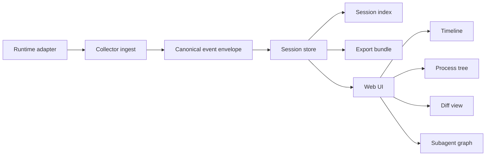

# TurnScope v0.1 Architecture

## Status

Draft for the first buildable milestone.

## One-line goal

TurnScope v0.1 should let a developer inspect a real coding-agent run as a single local timeline of turns, tools, shell processes, file changes, approval waits, and subagent hops.

## Why this milestone exists

The first release should prove three things:

1. TurnScope can normalize events from more than one runtime.
2. A local collector can store and reconstruct a session without a hosted backend.
3. A lightweight UI can make a run understandable faster than terminal scrollback or a final git diff.

If those three things work, the project is real.

## Product goals

- Ingest runtime events without replacing the runtime.
- Store sessions locally in a transparent, debuggable format.
- Render a session as a coherent, explorable timeline.
- Preserve causality between turn, tool, shell, diff, and subagent events.
- Make replay and export possible later without redesigning the data model.

## Non-goals for v0.1

- Full hosted multi-user product
- Perfect real-time sync across machines
- Rich auth or access-control model
- Long-term retention policies
- Vendor-specific lock-in features
- Full fidelity replay of every runtime-specific edge case

## Primary user stories

### Solo operator

A developer runs Codex or OpenClaw locally and wants to understand:

- where the run stalled
- which tool call failed
- which shell command spawned child processes
- which files changed after which turn
- whether a subagent branch caused the final regression

### Infra maintainer

An agent infra engineer wants a neutral event layer so multiple runtimes can be analyzed through one interface instead of separate dashboards.

### Research or eval workflow

A researcher wants to archive a run, re-open it later, and compare behavior over long trajectories without replaying live tools.

## System overview



## Main components

### 1. Runtime adapters

Adapters translate runtime-native events into TurnScope's canonical event envelope.

Expected early adapters:

- `packages/adapters-codex`
- `packages/adapters-openclaw`

Adapter responsibilities:

- map runtime-specific event names to canonical event types
- preserve raw source metadata when needed for debugging
- attach stable identifiers where the runtime provides them
- avoid lossy transformations in v0.1 unless unavoidable

Adapter non-responsibilities:

- storage
- indexing
- UI aggregation
- cross-session analytics

### 2. Collector

The collector is the write path into local storage.

Responsibilities:

- accept events as NDJSON or JSON arrays
- validate minimal event requirements
- partition events by session
- write append-only event logs
- write lightweight session summaries for quick listing

Initial implementation target:

- simple local file storage under an app-owned data directory
- one `*.ndjson` file per session
- one summary JSON sidecar per session

Why append-only first:

- easy to debug
- easy to export
- resilient to partial writes
- straightforward to migrate later into SQLite or DuckDB

### 3. Schema package

The schema package defines the canonical event envelope and example traces.

It should be the most stable contract in the repository.

Key design rule:

- the schema should describe what happened, not how a specific runtime happens to name it

### 4. Web UI

The UI is the first reading surface for a stored session.

v0.1 views:

- session summary
- timeline of ordered events
- shell process tree view
- file change list
- subagent graph summary
- error and approval highlights

UI principles:

- one session should be understandable in under 10 seconds
- errors and waits should stand out immediately
- raw event inspection should always be possible
- visual richness should not hide causality

### 5. Exporters

Exporters are intentionally secondary in v0.1, but the architecture should not block them.

Future exports:

- portable JSON bundle
- OpenTelemetry-compatible trace representation
- OpenInference-friendly trace bundle

## Canonical event envelope

Each event should carry a stable top-level shape.

```json
{
  "version": "0.1.0",
  "id": "evt_0001",
  "type": "tool.called",
  "occurred_at": "2026-04-21T00:00:00Z",
  "session_id": "sess_demo",
  "turn_id": "turn_002",
  "agent_id": "agent_lead",
  "parent_id": null,
  "source": {
    "runtime": "codex",
    "component": "tool",
    "origin": "adapter-codex"
  },
  "payload": {},
  "attributes": {}
}
```

Required fields for v0.1:

- `version`
- `id`
- `type`
- `occurred_at`
- `session_id`
- `source`
- `payload`

Common optional fields:

- `turn_id`
- `agent_id`
- `parent_id`
- `attributes`

## Event taxonomy

v0.1 canonical event types:

- `session.started`
- `session.finished`
- `turn.started`
- `turn.finished`
- `tool.called`
- `tool.finished`
- `shell.started`
- `shell.output`
- `shell.finished`
- `file.changed`
- `approval.requested`
- `approval.resolved`
- `subagent.spawned`
- `error.raised`

Design note:

- paired events such as `started` and `finished` make duration reconstruction easier than trying to infer everything from one terminal snapshot

## Storage model

### Session event log

- append-only NDJSON file per session
- order defined by file order plus `occurred_at`
- collector must preserve original arrival order when timestamps collide

### Session summary sidecar

Summary file should contain:

- session id
- runtime
- first timestamp
- last timestamp
- event counts by type
- high-level status
- derived stats such as number of turns, tool calls, approvals, shell commands, and errors

Why summaries matter:

- quick session listing
- fast filtering without reading every event file
- simpler future UI indexes

## Data flow

### Ingest path

1. runtime emits native events
2. adapter maps them to canonical envelope
3. collector validates minimum fields
4. collector appends event to session log
5. collector updates session summary
6. UI reads stored session and derives panels

### Read path

1. UI loads a session summary
2. UI loads its event log
3. UI groups events into derived structures:
   - turns
   - tool activity
   - shell tree
   - diff timeline
   - subagent graph
4. UI renders both the derived view and raw event detail

## Derived views

### Timeline

Ordered sequence of all events. This is the backbone view.

### Process tree

Built primarily from `shell.started`, `shell.finished`, and parent-child relationships in `attributes`.

### Diff timeline

Built from `file.changed` events. v0.1 can begin with metadata and summaries before full patch rendering.

### Subagent graph

Built from `subagent.spawned` and `agent_id` inheritance. The first version can be shallow and summary-oriented.

## Error handling strategy

v0.1 should prefer preserving partial truth over rejecting entire sessions.

Rules:

- invalid events should be reported and skipped, not silently accepted
- collector should continue processing the rest of a batch when possible
- summaries should record dropped-event counts
- UI should surface incomplete or degraded sessions clearly

## Security and privacy posture

TurnScope is local-first, but local does not mean risk-free.

v0.1 expectations:

- do not send data to hosted services by default
- preserve raw prompts and tool payloads only when explicitly present in source events
- design redaction hooks before introducing hosted sync
- treat shell output and file diffs as potentially sensitive data

## Repository responsibilities

### `apps/collector`

- local ingestion entrypoints
- session log writing
- session summary generation
- sample ingest workflows for development

### `apps/web`

- local session viewer
- prototype visualization panels
- static or near-static interface for early iteration

### `packages/schema`

- canonical event schema
- example traces
- schema notes and validation targets

### `packages/adapters-codex`

- mapping contract for Codex-native events
- fixtures or mapping notes

### `packages/adapters-openclaw`

- mapping contract for OpenClaw-native events
- fixtures or mapping notes

## Acceptance criteria for v0.1

TurnScope v0.1 is successful if all of the following are true:

- one Codex session can be ingested locally
- one OpenClaw session can be ingested locally
- stored sessions can be reopened later without the runtime running
- UI can show timeline, shell activity, file changes, and subagent relationships
- a contributor can understand the architecture by reading repo docs without external chat context

## Open questions

- should append-only files remain the source of truth after SQLite or DuckDB lands, or become import artifacts only?
- should the schema preserve raw runtime event blobs inside `payload.raw`, or only keep selected fields?
- what is the right balance between canonical event names and runtime-specific extensions?
- when comparison mode lands, should it live in the UI first or as an export pipeline first?

## Immediate next implementation moves

1. Freeze the event envelope in `packages/schema`.
2. Build the zero-dependency collector path that writes per-session NDJSON and summary JSON.
3. Build the static web prototype around one sample session.
4. Add adapter contracts as mapping docs before writing runtime-specific ingest code.
